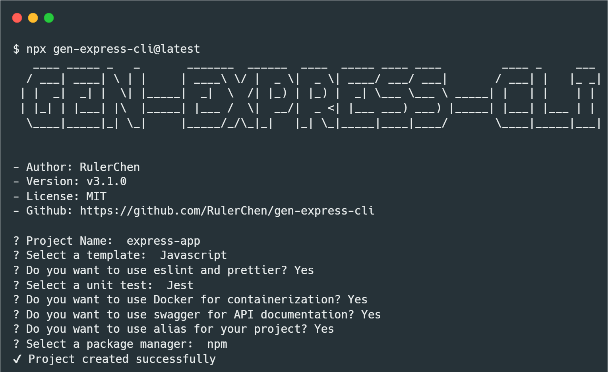

<h1 align="center">GEN-EXPRESS-CLI</h1>

<div align="center">
  
</div>

<div align="center" style="display: flex; justify-content: center; gap: 10px;">
  
  
  
  
  
  
</div>

<div align="center" style="display: flex; justify-content: center; gap: 10px;">

[English](./README.md)
[中文版本](./README.zh_TW.md)

</div>

## ✨ Features

- 🚀 **Quick Start**: Create a new project with a single command.
- 📦 **TypeScript Support**: Use TypeScript to develop your project.

## 📂 Quick Start

```bash
npx gen-express-cli <project-name>
```

## 📖 Usage



## 📚 License

This project is licensed under the terms of the MIT license.

## 🤝 Contributing

Contributions, issues and feature requests are welcome! Feel free to give your feedback and give me a star if you like this project.
